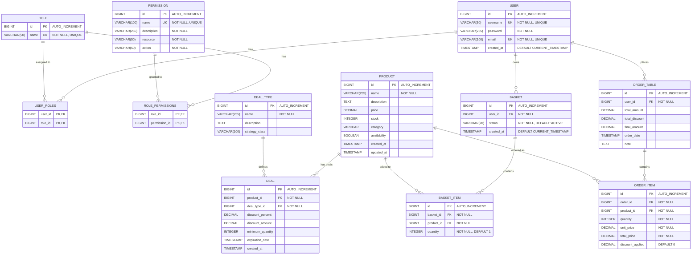

# Electronic Store Database Diagram

This document contains the database schema diagram for the Electronic Store application, based on the `schema.sql` file.

## Entity Relationship Diagram

## Table Descriptions

### User Management Tables

#### USER
- **Purpose**: Stores user account information
- **Key Features**: 
  - Unique username and email constraints
  - Password storage (encrypted)
  - Account creation timestamp

#### ROLE
- **Purpose**: Defines user roles (e.g., ADMIN, CUSTOMER)
- **Key Features**: 
  - Unique role names
  - Simple role-based access control

#### PERMISSION
- **Purpose**: Defines granular permissions for actions
- **Key Features**: 
  - Resource-action based permissions
  - Descriptive permission names
  - Flexible permission system

#### USER_ROLES (Junction Table)
- **Purpose**: Many-to-many relationship between users and roles
- **Key Features**: 
  - Composite primary key
  - Cascade delete on user/role removal

#### ROLE_PERMISSIONS (Junction Table)
- **Purpose**: Many-to-many relationship between roles and permissions
- **Key Features**: 
  - Composite primary key
  - Cascade delete on role/permission removal

### Product Management Tables

#### PRODUCT
- **Purpose**: Stores product catalog information
- **Key Features**: 
  - Product details (name, description, price)
  - Inventory tracking (stock, availability)
  - Category-based organization
  - Audit timestamps

### Deal Management Tables

#### DEAL_TYPE
- **Purpose**: Defines types of deals/promotions
- **Key Features**: 
  - Strategy pattern implementation
  - Flexible deal type system

#### DEAL
- **Purpose**: Stores active deals and promotions
- **Key Features**: 
  - Product-specific deals
  - Multiple discount types (percentage/fixed amount)
  - Minimum quantity requirements
  - Expiration date tracking

### Shopping System Tables

#### BASKET
- **Purpose**: User shopping basket/cart
- **Key Features**: 
  - User-specific baskets
  - Status tracking (ACTIVE, etc.)
  - Session management

#### BASKET_ITEM
- **Purpose**: Items in user's shopping basket
- **Key Features**: 
  - Product-basket relationship
  - Quantity tracking
  - Unique constraint per basket-product pair

### Order Management Tables

#### ORDER_TABLE
- **Purpose**: Completed customer orders
- **Key Features**: 
  - Financial totals (amount, discount, final)
  - Order date tracking
  - Optional notes

#### ORDER_ITEM
- **Purpose**: Individual items within an order
- **Key Features**: 
  - Product details at time of order
  - Pricing and discount tracking
  - Quantity and totals

## Key Relationships

1. **User Management**: Users can have multiple roles, roles can have multiple permissions
2. **Product Deals**: Products can have multiple deals, deals are of specific types
3. **Shopping Flow**: Users have baskets → baskets contain items → items reference products
4. **Order Flow**: Users place orders → orders contain items → items reference products
5. **Business Logic**: Deals apply to products and affect order pricing

## Database Features

- **Primary Keys**: All tables use auto-incrementing BIGINT primary keys
- **Foreign Key Constraints**: Proper referential integrity with cascade deletes where appropriate
- **Unique Constraints**: Prevent duplicate usernames, emails, and role names
- **Default Values**: Sensible defaults for timestamps, quantities, and status fields
- **Data Types**: Appropriate types for financial data (DECIMAL), text content, and timestamps

## Notes

- The `USER` table is quoted because "user" is a reserved keyword in some databases
- Financial amounts use DECIMAL type to avoid floating-point precision issues
- Timestamps are used for audit trails and business logic (deal expiration)
- The design supports both percentage and fixed-amount discounts
- Basket items have unique constraints to prevent duplicate products in the same basket
